+++
title = "Codex 新手安装与配置教程"
slug = "codex-install"
date = "2026-06-23T23:00:59+08:00"
draft = false
description = "安装 Codex，并通过中转站配置 API 密钥的完整图文步骤。"
image = "codex.jpg"
tags = ["AI", "Codex"]
categories = ["教程"]
comments = false
+++

这篇文章记录安装 Codex，并完成 API 密钥配置的全过程。

## 安装Codex

打开电脑的微软应用商店 Microsoft Store，注意不要开任何代理软件。

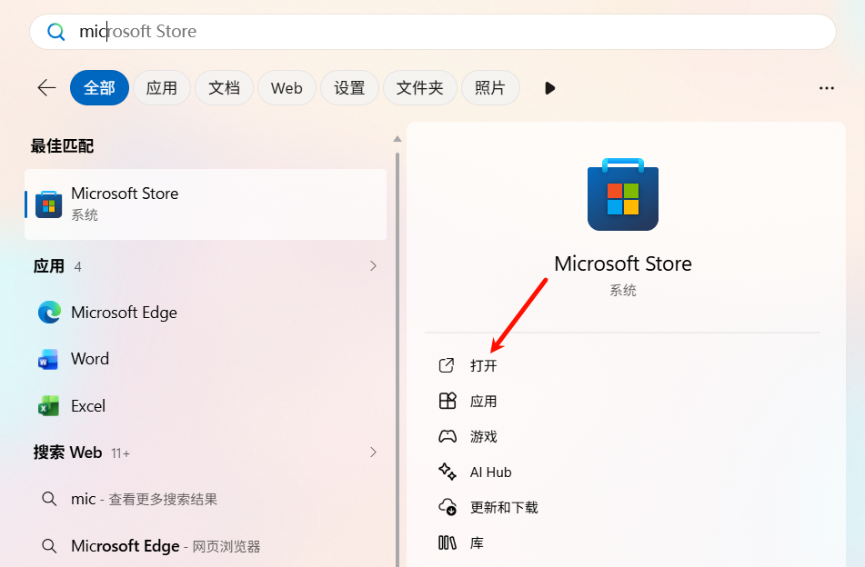

在微软应用商店里搜索 `codex` 并下载。

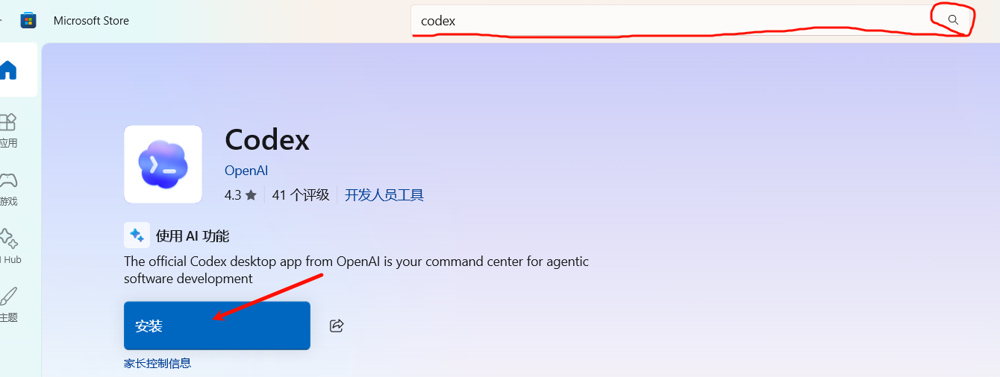

第一次打开加载比较久，这是正常现象。

## 注册并登录中转站

打开氧气中转站 [yqz666.xyz](https://yqz666.xyz)，同意服务条款后登录，没有账号先注册一个。

注册时如果收不到不到邀请码请先查看邮箱垃圾箱，若垃圾箱里面没有请加群反馈 QQ 群：`139504197`

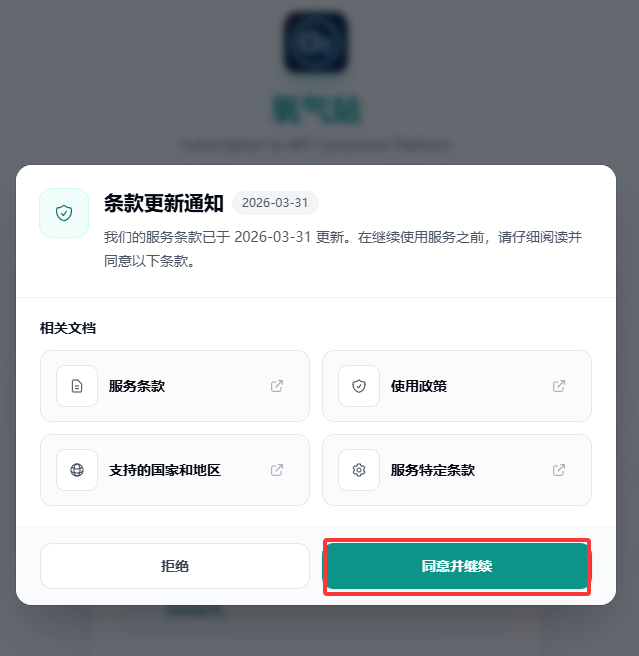

## 充值

使用前先进行充值，账号没有余额时密钥无法调用。

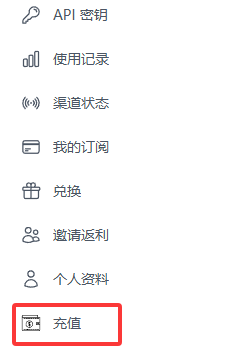

在充值界面购买到兑换码后记得到中转站的兑换页面进行兑换

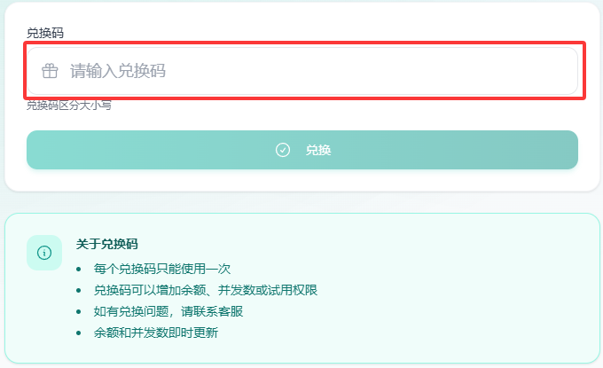

## 创建密钥

充值后，找到 API 密钥页面。

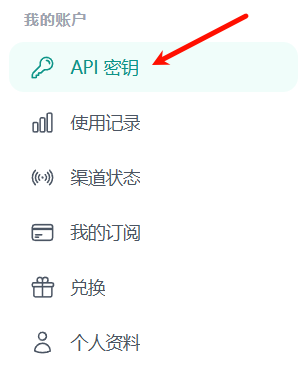

点击右上角创建密钥。

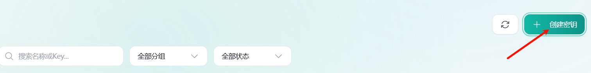

名称随便输入一个即可，选择需要的分组后，直接点击创建。

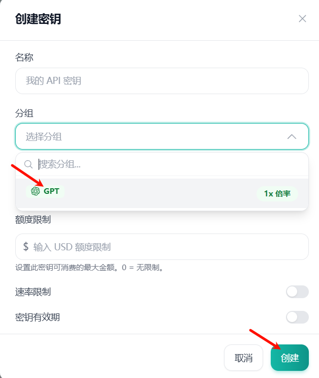

## API密钥使用教程

创建好密钥后，点击使用密钥。

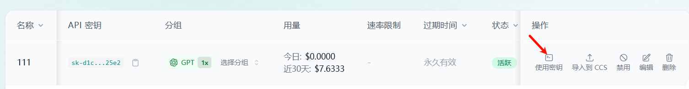

在自己电脑的用户路径下找到红圈中的两个文件：`config.toml` 和 `auth.json`

如果没有找到，就自己创建这两个文件。创建前请确保已经打开显示文件扩展名!

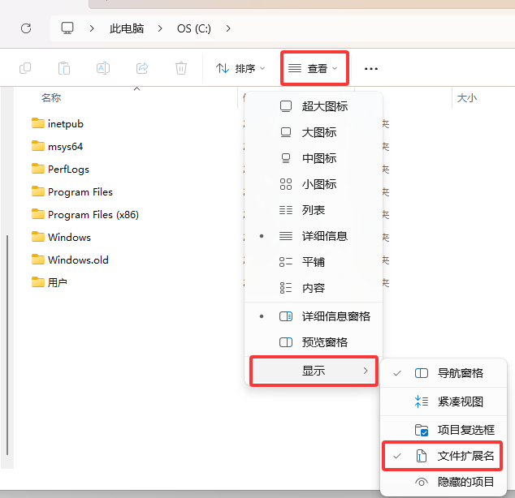

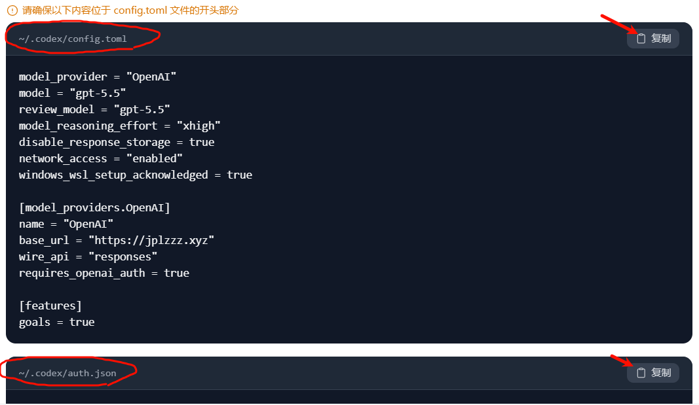

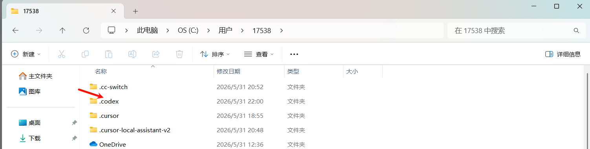

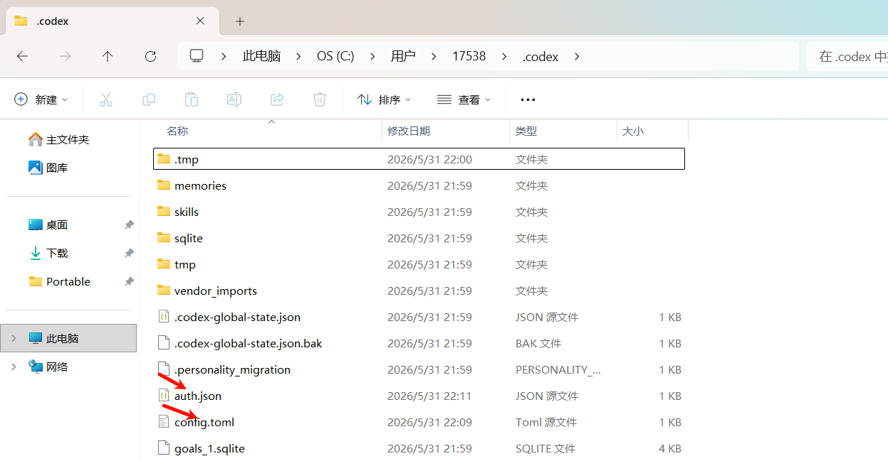

打开这两个文件，将从中转站复制的内容分别替换到这两个文件里。

也就是打开文件后，按 `Ctrl + A` 全选，再按 `Ctrl + V` 粘贴到文件中，而不是在原有文件的末尾追加配置内容。

回到氧气中转站 [yqz666.xyz](https://yqz666.xyz)，然后复制密钥。

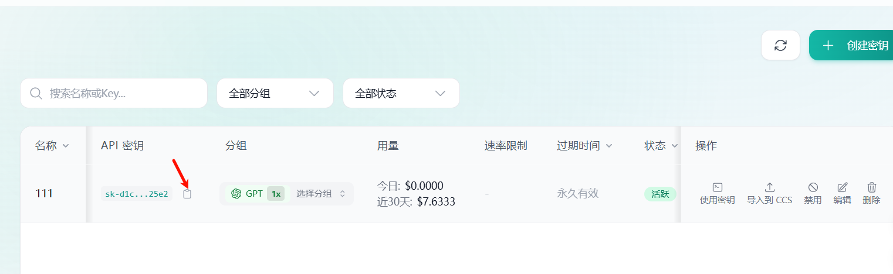

## 登录codex

回到 Codex，选择 `sign in another way`。

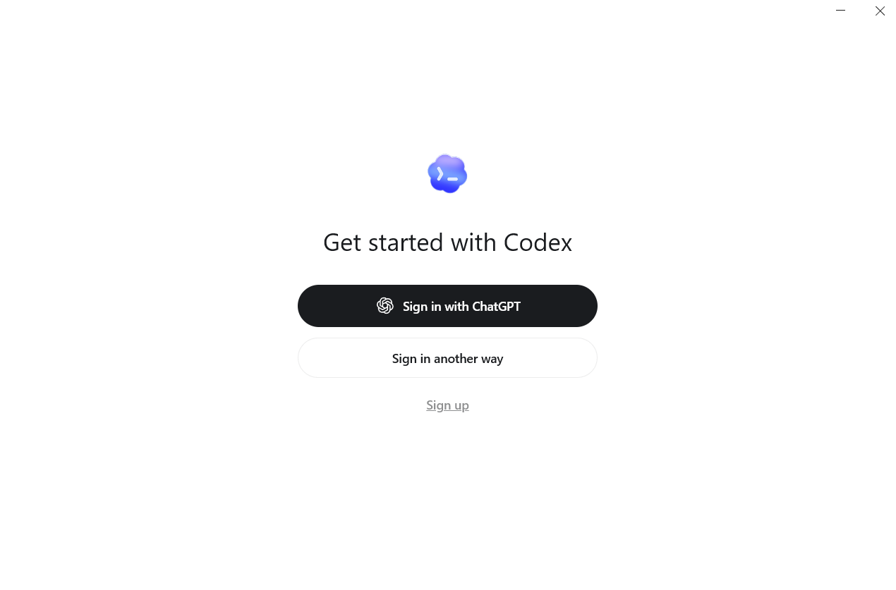

将复制的密钥输入即可。

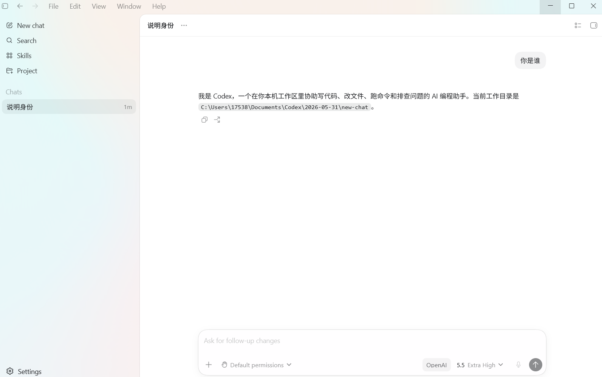

## 此致敬礼

至此，你的路才刚刚开始。
教程不易，交流请加 QQ 群：`139504197`
